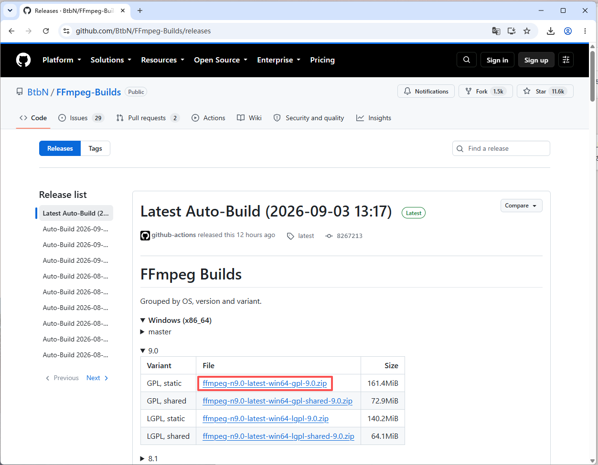
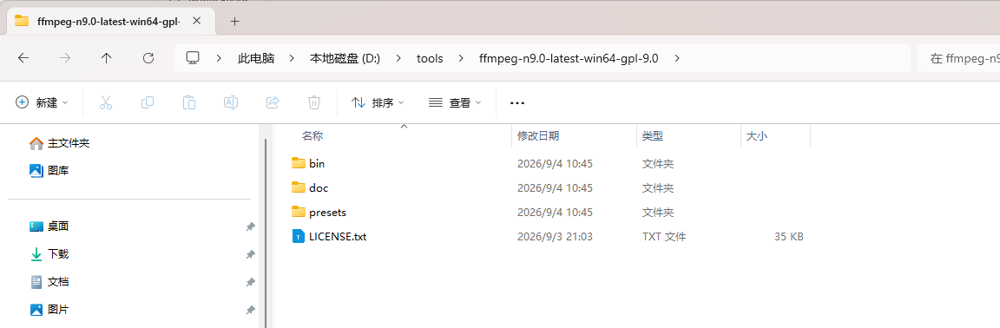

# FFmpeg 安装教程 / FFmpeg Installation Guide

> 适用系统：Windows / Applies to Windows

---

## 中文版

### 1. 打开下载页面

浏览器打开 [https://github.com/BtbN/FFmpeg-Builds/releases](https://github.com/BtbN/FFmpeg-Builds/releases)。

### 2. 下载二进制版本的压缩包

在页面中下载 Windows 二进制版本的压缩包（如 `ffmpeg-master-latest-win64-gpl.zip`）。

### 3. 解压到 D:\tools\ 目录下

将压缩包解压到 `D:\tools\` 目录下（解压后无需配置环境变量，本软件会自动扫描 `D:\tools\ffmpeg*\bin\` 中的 ffmpeg 与 ffprobe）。

完成后重新启动「批量剪辑」即可自动识别 FFmpeg。

---

## English

### 1. Open the download page

Open [https://github.com/BtbN/FFmpeg-Builds/releases](https://github.com/BtbN/FFmpeg-Builds/releases) in your browser.

### 2. Download the binary archive

Download the Windows binary archive (e.g. `ffmpeg-master-latest-win64-gpl.zip`) from the page.

### 3. Extract it under D:\tools\

Extract the archive under `D:\tools\` (no environment variable setup is needed — this app automatically scans `D:\tools\ffmpeg*\bin\` for ffmpeg and ffprobe).

Restart Batch Cut after installation, and FFmpeg will be detected automatically.
